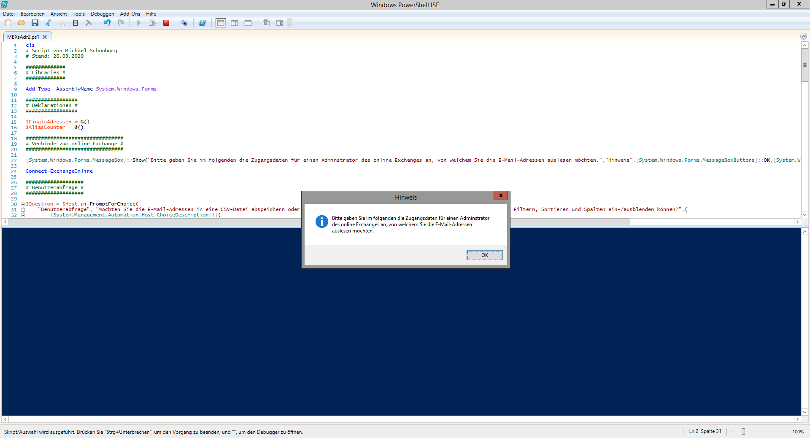
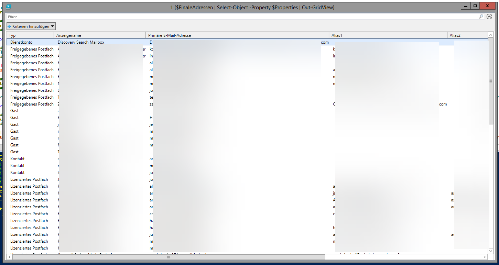
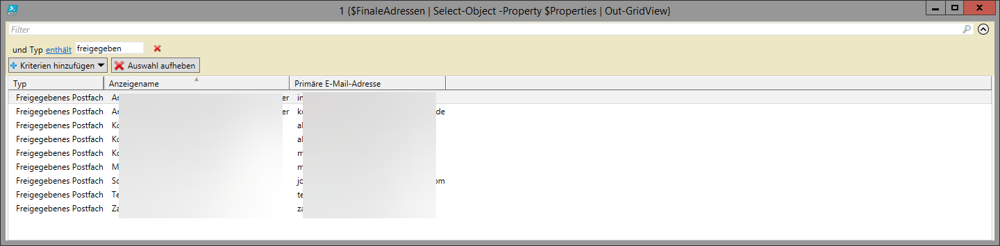

# Get-AllAddresses
PowerShell-Skript zum Lesen aller Adressen (einschließlich Aliase) von allen Entitäten (normales Postfach, freigegebenes Postfach, E-Mail-aktivierter öffentlicher Ordner, Kontakt, einheitliche Gruppe, Verteilergruppe, Sicherheitsgruppe usw.), die in einem Exchange Online Server vorhanden sind.

Der Code dieses Projekts folgt weitgehend dem PowerShell-Praxis- und Stilleitfaden sowie den Überlegungen zur PowerShell-Skriptleistung von Microsoft.

Style guide: https://poshcode.gitbook.io/powershell-practice-and-style/

Performance Considerations: https://docs.microsoft.com/en-us/powershell/scripting/dev-cross-plat/performance/script-authoring-considerations?view=powershell-7.1

# Anleitung
1. Wählen Sie bei der ersten Abfrage "S" für "Specific Customer".
2. Geben Sie Zugansdaten eines Exchange Administrators für den jeweiligen Online Exchange Server an, von dem Sie die E-Mail-Adressen auslesen möchten.

(Den gelben Text in der Konsole können Sie getrost ignorieren)
3. Wählen Sie, ob Sie die Tabelle zu einer CSV-Datei exportieren oder direkt ansehen wollen.

Wenn Sie die Tabelle direkt ansehen wollen, können Sie hier auch Sortieren, Filtern und Spalten ein-/ausblenden.
4. Nachdem Sie gewählt haben wird eine Weile lang nichs passieren, weil das Script ohne Rückmeldung im Hintergrund läuft.
5. Wenn Sie den CSV-Export gewählt haben, wird Ihnen - sobald das Script durchgelaufen ist - eine Standard Windows-Dialog zum Speichern der CSV-Datei angezeigt. Sollten Sie die Tabelle gewählt haben wir ihnen entsprechende Tabelle angezeigt und Sie können hier suchen, filtern, sortieren (indem Sie auf einen Spaltenkopf klicken) und Spalten ein- oder ausblenden.

6. So werden z. B. alle freigegebenen Postfächer angezeigt, wobei nach Anzeigenamen alphabetisch sortiert wird und die Aliase ausgeblendet wurden:

