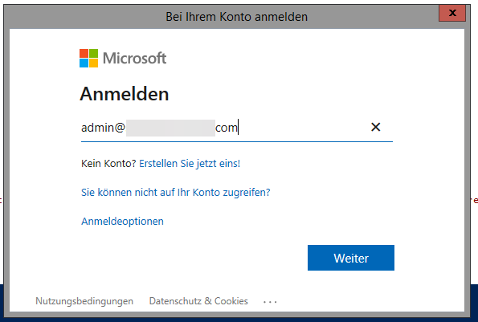

# Get-AllAddresses
PowerShell Script to read all addresses (including aliases) from all entities (regular mailbox, shared mailbox, mail enbaled public folder, contact, unified group, distribution group, security group, ...) there are in a microsoft 365 tenant.

This projects code loosely follows the PowerShell Practice and Style guide, as well as Microsofts PowerShell scripting performance considerations.

Style guide: https://poshcode.gitbook.io/powershell-practice-and-style/

Performance Considerations: https://docs.microsoft.com/en-us/powershell/scripting/dev-cross-plat/performance/script-authoring-considerations?view=powershell-7.1

# Anleitung
1. Geben Sie Zugansdaten eines Administrator für den jeweiligen Online Exchange an, von dem Sie die E-Mail-Adressen auslesen möchten. Z. B. Ihre Office 365 Zugansdaten, wenn Sie SI-Mitarbeiter sind und den IT-Center Engels Exchange abfragen wollen oder die Zugansdaten eines Office 365 Kunden Administrators, im folgenden Beispiel wurde der Administrator des Kunden Schnitzler gewählt.

(Den gelben Text in der Konsole können Sie getrost ignorieren)
2. Wählen Sie, ob Sie die Tabelle zu einer CSV-Datei exportieren oder direkt ansehen wollen.

Wenn Sie die Tabelle direkt ansehen wollen, können Sie hier auch Sortieren, Filtern und Spalten ein-/ausblenden.
3. Nachdem Sie gewählt haben wird eine Weile lang nichs passieren, weil das Script ohne Rückmeldung im Hintergrund läuft.
4. Wenn Sie den CSV-Export gewählt haben, wird Ihnen - sobald das Script durchgelaufen ist - eine Standard Windows-Dialog zum Speichern der CSV-Datei angezeigt. Sollten Sie die Tabelle gewählt haben wir ihnen entsprechende Tabelle angezeigt und Sie können hier suchen, filtern, sortieren (indem Sie auf einen Spaltenkopf klicken) und Spalten ein- oder ausblenden.

5. So werden z. B. alle freigegebenen Postfächer angezeigt, wobei nach Anzeigenamen alphabetisch sortiert wird und die Aliase ausgeblendet wurden:

